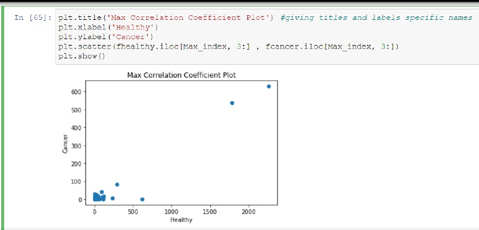
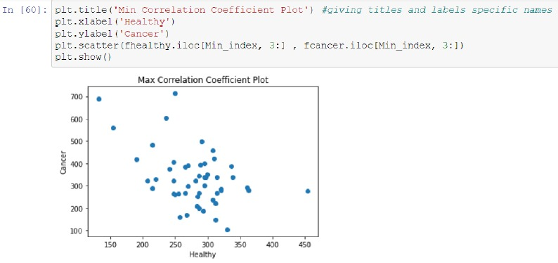
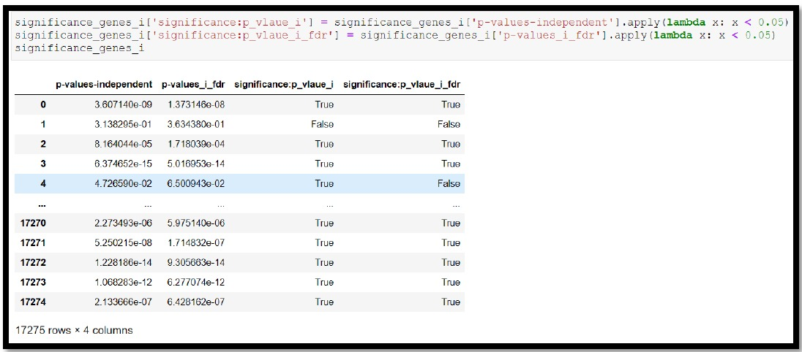
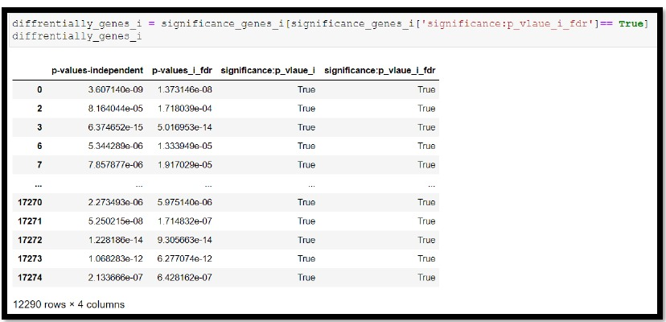

# Gene expression statistical analysis for cancer 

### We want to analyze gene expression (GE) data for the cancer type Lung Squamous Cell Carcinoma (LUSC) applying correlation and hypothesis test concepts.

***

## *Correlation*
- The correlation coefficient is a statistical measure of the strength of the relationship between the relative movements of two variables.
- We want to know How likely is the relationship between the two data frames of healthy and cancerous genes to be linear and which gene expressions that associate highly in the precedence of the disease in addition to know how strong their relationship is. 

- The main components of any signal(or image) are the phase and magnitude. We are gonna show how important is the phase and to what extent it has most of weight of image details. 

## *Hypothesis test*
- We are going to use hypothesis test assuming that null hypothesis (H0) is gene's expression doesn't affect having cancer and the alternative hypothesis (H1) represents gene's expression affects on existence of cancer.

***
#### *For further information you can read the report*
***

***

It was a team project done by:

[Mariam Ashraf](https://github.com/mariamashraf731), 
[Marwa Abdelaal](https://github.com/MarwaAbdelAal), 
[Nada Ezzat](https://github.com/nadaezzat-99), 
[Noura Mahmoud](https://github.com/Noura-Mahmoud)

***
